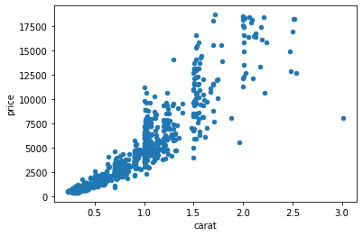
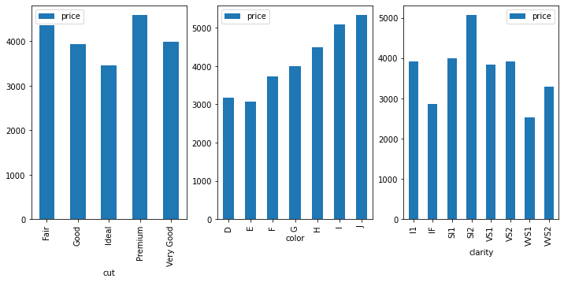

# Multiple Linear Regression - Cumulative Lab

## Introduction

In this cumulative lab you'll perform an end-to-end analysis of a dataset using multiple linear regression.

## Objectives

You will be able to:

* Prepare data for regression analysis using pandas
* Build multiple linear regression models using StatsModels
* Measure regression model performance
* Interpret multiple linear regression coefficients

## Your Task: Develop a Model of Diamond Prices


Photo by <a href="https://unsplash.com/@tahliaclaire?utm_source=unsplash&utm_medium=referral&utm_content=creditCopyText">Tahlia Doyle</a> on <a href="https://unsplash.com/s/photos/diamonds?utm_source=unsplash&utm_medium=referral&utm_content=creditCopyText">Unsplash</a>

### Business Understanding

You've been asked to perform an analysis to see how various factors impact the price of diamonds. There are various [guides online](https://www.diamonds.pro/education/diamond-prices/) that claim to tell consumers how to avoid getting "ripped off", but you've been asked to dig into the data to see whether these claims ring true.

### Data Understanding

We have downloaded a diamonds dataset from [Kaggle](https://www.kaggle.com/datasets/shivam2503/diamonds), which came with this description:

* **price** price in US dollars (\$326--\$18,823)
* **carat** weight of the diamond (0.2--5.01)
* **cut** quality of the cut (Fair, Good, Very Good, Premium, Ideal)
* **color** diamond colour, from J (worst) to D (best)
* **clarity** a measurement of how clear the diamond is (I1 (worst), SI2, SI1, VS2, VS1, VVS2, VVS1, IF (best))
* **x** length in mm (0--10.74)
* **y** width in mm (0--58.9)
* **z** depth in mm (0--31.8)
* **depth** total depth percentage = z / mean(x, y) = 2 * z / (x + y) (43--79)
* **table** width of top of diamond relative to widest point (43--95)

### Requirements

#### 1. Load the Data Using Pandas

Practice once again with loading CSV data into a `pandas` dataframe.

#### 2. Build a Baseline Simple Linear Regression Model

Identify the feature that is most correlated with `price` and build a StatsModels linear regression model using just that feature.

#### 3. Evaluate and Interpret Baseline Model Results

Explain the overall performance as well as parameter coefficients for the baseline simple linear regression model.

#### 4. Prepare a Categorical Feature for Multiple Regression Modeling

Identify a promising categorical feature and use `pd.get_dummies()` to prepare it for modeling.

#### 5. Build a Multiple Linear Regression Model

Using the data from Step 4, create a second StatsModels linear regression model using one numeric feature and one one-hot encoded categorical feature.

#### 6. Evaluate and Interpret Multiple Linear Regression Model Results

Explain the performance of the new model in comparison with the baseline, and interpret the new parameter coefficients.

## 1. Load the Data Using Pandas

Import `pandas` (with the standard alias `pd`), and load the data from the file `diamonds.csv` into a DataFrame called `diamonds`.

Be sure to specify `index_col=0` to avoid creating an "Unnamed: 0" column.


```python
import pandas as pd
diamonds = pd.read_csv("diamonds.csv", index_col=0)
diamonds
```


<div>
<style scoped>
    .dataframe tbody tr th:only-of-type {
        vertical-align: middle;
    }

    .dataframe tbody tr th {
        vertical-align: top;
    }

    .dataframe thead th {
        text-align: right;
    }
</style>
<table border="1" class="dataframe">
  <thead>
    <tr style="text-align: right;">
      <th></th>
      <th>carat</th>
      <th>cut</th>
      <th>color</th>
      <th>clarity</th>
      <th>depth</th>
      <th>table</th>
      <th>price</th>
      <th>x</th>
      <th>y</th>
      <th>z</th>
    </tr>
  </thead>
  <tbody>
    <tr>
      <th>1</th>
      <td>0.23</td>
      <td>Ideal</td>
      <td>E</td>
      <td>SI2</td>
      <td>61.5</td>
      <td>55.0</td>
      <td>326</td>
      <td>3.95</td>
      <td>3.98</td>
      <td>2.43</td>
    </tr>
    <tr>
      <th>2</th>
      <td>0.21</td>
      <td>Premium</td>
      <td>E</td>
      <td>SI1</td>
      <td>59.8</td>
      <td>61.0</td>
      <td>326</td>
      <td>3.89</td>
      <td>3.84</td>
      <td>2.31</td>
    </tr>
    <tr>
      <th>3</th>
      <td>0.23</td>
      <td>Good</td>
      <td>E</td>
      <td>VS1</td>
      <td>56.9</td>
      <td>65.0</td>
      <td>327</td>
      <td>4.05</td>
      <td>4.07</td>
      <td>2.31</td>
    </tr>
    <tr>
      <th>4</th>
      <td>0.29</td>
      <td>Premium</td>
      <td>I</td>
      <td>VS2</td>
      <td>62.4</td>
      <td>58.0</td>
      <td>334</td>
      <td>4.20</td>
      <td>4.23</td>
      <td>2.63</td>
    </tr>
    <tr>
      <th>5</th>
      <td>0.31</td>
      <td>Good</td>
      <td>J</td>
      <td>SI2</td>
      <td>63.3</td>
      <td>58.0</td>
      <td>335</td>
      <td>4.34</td>
      <td>4.35</td>
      <td>2.75</td>
    </tr>
    <tr>
      <th>...</th>
      <td>...</td>
      <td>...</td>
      <td>...</td>
      <td>...</td>
      <td>...</td>
      <td>...</td>
      <td>...</td>
      <td>...</td>
      <td>...</td>
      <td>...</td>
    </tr>
    <tr>
      <th>53936</th>
      <td>0.72</td>
      <td>Ideal</td>
      <td>D</td>
      <td>SI1</td>
      <td>60.8</td>
      <td>57.0</td>
      <td>2757</td>
      <td>5.75</td>
      <td>5.76</td>
      <td>3.50</td>
    </tr>
    <tr>
      <th>53937</th>
      <td>0.72</td>
      <td>Good</td>
      <td>D</td>
      <td>SI1</td>
      <td>63.1</td>
      <td>55.0</td>
      <td>2757</td>
      <td>5.69</td>
      <td>5.75</td>
      <td>3.61</td>
    </tr>
    <tr>
      <th>53938</th>
      <td>0.70</td>
      <td>Very Good</td>
      <td>D</td>
      <td>SI1</td>
      <td>62.8</td>
      <td>60.0</td>
      <td>2757</td>
      <td>5.66</td>
      <td>5.68</td>
      <td>3.56</td>
    </tr>
    <tr>
      <th>53939</th>
      <td>0.86</td>
      <td>Premium</td>
      <td>H</td>
      <td>SI2</td>
      <td>61.0</td>
      <td>58.0</td>
      <td>2757</td>
      <td>6.15</td>
      <td>6.12</td>
      <td>3.74</td>
    </tr>
    <tr>
      <th>53940</th>
      <td>0.75</td>
      <td>Ideal</td>
      <td>D</td>
      <td>SI2</td>
      <td>62.2</td>
      <td>55.0</td>
      <td>2757</td>
      <td>5.83</td>
      <td>5.87</td>
      <td>3.64</td>
    </tr>
  </tbody>
</table>
<p>53940 rows × 10 columns</p>
</div>


The following code checks that you loaded the data correctly:


```python

# diamonds should be a dataframe
assert type(diamonds) == pd.DataFrame

# Check that there are the correct number of rows
assert diamonds.shape[0] == 53940

# Check that there are the correct number of columns
# (if this crashes, make sure you specified `index_col=0`)
assert diamonds.shape[1] == 10
```

Inspect the distributions of the numeric features:


```python
diamonds.describe()
```


<div>
<style scoped>
    .dataframe tbody tr th:only-of-type {
        vertical-align: middle;
    }

    .dataframe tbody tr th {
        vertical-align: top;
    }

    .dataframe thead th {
        text-align: right;
    }
</style>
<table border="1" class="dataframe">
  <thead>
    <tr style="text-align: right;">
      <th></th>
      <th>carat</th>
      <th>depth</th>
      <th>table</th>
      <th>price</th>
      <th>x</th>
      <th>y</th>
      <th>z</th>
    </tr>
  </thead>
  <tbody>
    <tr>
      <th>count</th>
      <td>53940.000000</td>
      <td>53940.000000</td>
      <td>53940.000000</td>
      <td>53940.000000</td>
      <td>53940.000000</td>
      <td>53940.000000</td>
      <td>53940.000000</td>
    </tr>
    <tr>
      <th>mean</th>
      <td>0.797940</td>
      <td>61.749405</td>
      <td>57.457184</td>
      <td>3932.799722</td>
      <td>5.731157</td>
      <td>5.734526</td>
      <td>3.538734</td>
    </tr>
    <tr>
      <th>std</th>
      <td>0.474011</td>
      <td>1.432621</td>
      <td>2.234491</td>
      <td>3989.439738</td>
      <td>1.121761</td>
      <td>1.142135</td>
      <td>0.705699</td>
    </tr>
    <tr>
      <th>min</th>
      <td>0.200000</td>
      <td>43.000000</td>
      <td>43.000000</td>
      <td>326.000000</td>
      <td>0.000000</td>
      <td>0.000000</td>
      <td>0.000000</td>
    </tr>
    <tr>
      <th>25%</th>
      <td>0.400000</td>
      <td>61.000000</td>
      <td>56.000000</td>
      <td>950.000000</td>
      <td>4.710000</td>
      <td>4.720000</td>
      <td>2.910000</td>
    </tr>
    <tr>
      <th>50%</th>
      <td>0.700000</td>
      <td>61.800000</td>
      <td>57.000000</td>
      <td>2401.000000</td>
      <td>5.700000</td>
      <td>5.710000</td>
      <td>3.530000</td>
    </tr>
    <tr>
      <th>75%</th>
      <td>1.040000</td>
      <td>62.500000</td>
      <td>59.000000</td>
      <td>5324.250000</td>
      <td>6.540000</td>
      <td>6.540000</td>
      <td>4.040000</td>
    </tr>
    <tr>
      <th>max</th>
      <td>5.010000</td>
      <td>79.000000</td>
      <td>95.000000</td>
      <td>18823.000000</td>
      <td>10.740000</td>
      <td>58.900000</td>
      <td>31.800000</td>
    </tr>
  </tbody>
</table>
</div>


And inspect the value counts for the categorical features:


```python
categoricals = diamonds.select_dtypes("object")

for col in categoricals:
    print(diamonds[col].value_counts(), "\n")
```

    Ideal        21551
    Premium      13791
    Very Good    12082
    Good          4906
    Fair          1610
    Name: cut, dtype: int64 
    
    G    11292
    E     9797
    F     9542
    H     8304
    D     6775
    I     5422
    J     2808
    Name: color, dtype: int64 
    
    SI1     13065
    VS2     12258
    SI2      9194
    VS1      8171
    VVS2     5066
    VVS1     3655
    IF       1790
    I1        741
    Name: clarity, dtype: int64 
    


## 2. Build a Baseline Simple Linear Regression Model

### Identifying a Highly Correlated Predictor

The target variable is `price`. Look at the correlation coefficients for all of the predictor variables to find the one with the highest correlation with `price`.


```python
diamonds.corr()["price"]
```


    carat    0.921591
    depth   -0.010647
    table    0.127134
    price    1.000000
    x        0.884435
    y        0.865421
    z        0.861249
    Name: price, dtype: float64


Identify the name of the predictor column with the strongest correlation below.


```python
most_correlated = "carat"
```

The following code checks that you specified a column correctly:


```python

# most_correlated should be a string
assert type(most_correlated) == str

# most_correlated should be one of the columns other than price
assert most_correlated in diamonds.drop("price", axis=1).columns
```

### Plotting the Predictor vs. Price

We'll also create a scatter plot of that variable vs. `price`:


```python

# Plot a sample of 1000 data points, most_correlated vs. price
diamonds.sample(1000, random_state=1).plot.scatter(x=most_correlated, y="price");
```


    

    


### Setting Up Variables for Regression

Declare `y` and `X_baseline` variables, where `y` is a Series containing `price` data and `X_baseline` is a DataFrame containing the column with the strongest correlation.


```python
y = diamonds["price"]
X_baseline = diamonds[[most_correlated]]
```

The following code checks that you created valid `y` and `X_baseline` variables:


```python

# y should be a series
assert type(y) == pd.Series

# y should contain about 54k rows
assert y.shape == (53940,)

# X_baseline should be a DataFrame
assert type(X_baseline) == pd.DataFrame

# X_baseline should contain the same number of rows as y
assert X_baseline.shape[0] == y.shape[0]

# X_baseline should have 1 column
assert X_baseline.shape[1] == 1
```

### Creating and Fitting Simple Linear Regression

The following code uses your variables to build and fit a simple linear regression.


```python
import statsmodels.api as sm

baseline_model = sm.OLS(y, sm.add_constant(X_baseline))
baseline_results = baseline_model.fit()
```

## 3. Evaluate and Interpret Baseline Model Results

Write any necessary code to evaluate the model performance overall and interpret its coefficients.


```python
print(baseline_results.summary())
```

                                OLS Regression Results                            
    ==============================================================================
    Dep. Variable:                  price   R-squared:                       0.849
    Model:                            OLS   Adj. R-squared:                  0.849
    Method:                 Least Squares   F-statistic:                 3.041e+05
    Date:                Mon, 16 May 2022   Prob (F-statistic):               0.00
    Time:                        17:25:28   Log-Likelihood:            -4.7273e+05
    No. Observations:               53940   AIC:                         9.455e+05
    Df Residuals:                   53938   BIC:                         9.455e+05
    Df Model:                           1                                         
    Covariance Type:            nonrobust                                         
    ==============================================================================
                     coef    std err          t      P>|t|      [0.025      0.975]
    ------------------------------------------------------------------------------
    const      -2256.3606     13.055   -172.830      0.000   -2281.949   -2230.772
    carat       7756.4256     14.067    551.408      0.000    7728.855    7783.996
    ==============================================================================
    Omnibus:                    14025.341   Durbin-Watson:                   0.986
    Prob(Omnibus):                  0.000   Jarque-Bera (JB):           153030.525
    Skew:                           0.939   Prob(JB):                         0.00
    Kurtosis:                      11.035   Cond. No.                         3.65
    ==============================================================================
    
    Notes:
    [1] Standard Errors assume that the covariance matrix of the errors is correctly specified.


```python
from sklearn.metrics import mean_absolute_error

baseline_mae = mean_absolute_error(y, baseline_results.predict(sm.add_constant(X_baseline)))
baseline_mae
```


    1007.4632473569848


Then summarize your findings below:

<details>
    <summary style="cursor: pointer"><b>Solution (click to expand)</b></summary>

`carat` was the attribute most strongly correlated with `price`, therefore our model is describing this relationship.

Overall this model is statistically significant and explains about 85% of the variance in price. In a typical prediction, the model is off by about &dollar;1k.

* The intercept is at about -\\$2.3k. This means that a zero-carat diamond would sell for -\\$2.3k.
* The coefficient for `carat` is about \\$7.8k. This means for each additional carat, the diamond costs about \\$7.8k more.

</details>    

## 4. Prepare a Categorical Feature for Multiple Regression Modeling

Now let's go beyond our simple linear regression and add a categorical feature.

### Identifying a Promising Predictor

Below we create bar graphs for the categories present in each categorical feature:


```python
import matplotlib.pyplot as plt

categorical_features = diamonds.select_dtypes("object").columns
fig, axes = plt.subplots(ncols=len(categorical_features), figsize=(12,5))

for index, feature in enumerate(categorical_features):
    diamonds.groupby(feature).mean().plot.bar(
        y="price", ax=axes[index])
```


    

    


Identify the name of the categorical predictor column you want to use in your model below. The choice here is more open-ended than choosing the numeric predictor above -- choose something that will be interpretable in a final model, and where the different categories seem to have an impact on the price.


```python
cat_col = "cut"
```

The following code checks that you specified a column correctly:


```python

# cat_col should be a string
assert type(cat_col) == str

# cat_col should be one of the categorical columns
assert cat_col in diamonds.select_dtypes("object").columns
```

### Setting Up Variables for Regression

The code below creates a variable `X_iterated`: a DataFrame containing the column with the strongest correlation **and** your selected categorical feature.


```python
X_iterated = diamonds[[most_correlated, cat_col]]
X_iterated
```


<div>
<style scoped>
    .dataframe tbody tr th:only-of-type {
        vertical-align: middle;
    }

    .dataframe tbody tr th {
        vertical-align: top;
    }

    .dataframe thead th {
        text-align: right;
    }
</style>
<table border="1" class="dataframe">
  <thead>
    <tr style="text-align: right;">
      <th></th>
      <th>carat</th>
      <th>cut</th>
    </tr>
  </thead>
  <tbody>
    <tr>
      <th>1</th>
      <td>0.23</td>
      <td>Ideal</td>
    </tr>
    <tr>
      <th>2</th>
      <td>0.21</td>
      <td>Premium</td>
    </tr>
    <tr>
      <th>3</th>
      <td>0.23</td>
      <td>Good</td>
    </tr>
    <tr>
      <th>4</th>
      <td>0.29</td>
      <td>Premium</td>
    </tr>
    <tr>
      <th>5</th>
      <td>0.31</td>
      <td>Good</td>
    </tr>
    <tr>
      <th>...</th>
      <td>...</td>
      <td>...</td>
    </tr>
    <tr>
      <th>53936</th>
      <td>0.72</td>
      <td>Ideal</td>
    </tr>
    <tr>
      <th>53937</th>
      <td>0.72</td>
      <td>Good</td>
    </tr>
    <tr>
      <th>53938</th>
      <td>0.70</td>
      <td>Very Good</td>
    </tr>
    <tr>
      <th>53939</th>
      <td>0.86</td>
      <td>Premium</td>
    </tr>
    <tr>
      <th>53940</th>
      <td>0.75</td>
      <td>Ideal</td>
    </tr>
  </tbody>
</table>
<p>53940 rows × 2 columns</p>
</div>


### Preprocessing Categorical Variable

If we tried to pass `X_iterated` as-is into `sm.OLS`, we would get an error. We need to use `pd.get_dummies` to create dummy variables for `cat_col`.

**DO NOT** use `drop_first=True`, so that you can intentionally set a meaningful reference category instead.


```python

# Use pd.get_dummies to one-hot encode the categorical column in X_iterated
X_iterated = pd.get_dummies(X_iterated, columns=[cat_col])
X_iterated
```


<div>
<style scoped>
    .dataframe tbody tr th:only-of-type {
        vertical-align: middle;
    }

    .dataframe tbody tr th {
        vertical-align: top;
    }

    .dataframe thead th {
        text-align: right;
    }
</style>
<table border="1" class="dataframe">
  <thead>
    <tr style="text-align: right;">
      <th></th>
      <th>carat</th>
      <th>cut_Fair</th>
      <th>cut_Good</th>
      <th>cut_Ideal</th>
      <th>cut_Premium</th>
      <th>cut_Very Good</th>
    </tr>
  </thead>
  <tbody>
    <tr>
      <th>1</th>
      <td>0.23</td>
      <td>0</td>
      <td>0</td>
      <td>1</td>
      <td>0</td>
      <td>0</td>
    </tr>
    <tr>
      <th>2</th>
      <td>0.21</td>
      <td>0</td>
      <td>0</td>
      <td>0</td>
      <td>1</td>
      <td>0</td>
    </tr>
    <tr>
      <th>3</th>
      <td>0.23</td>
      <td>0</td>
      <td>1</td>
      <td>0</td>
      <td>0</td>
      <td>0</td>
    </tr>
    <tr>
      <th>4</th>
      <td>0.29</td>
      <td>0</td>
      <td>0</td>
      <td>0</td>
      <td>1</td>
      <td>0</td>
    </tr>
    <tr>
      <th>5</th>
      <td>0.31</td>
      <td>0</td>
      <td>1</td>
      <td>0</td>
      <td>0</td>
      <td>0</td>
    </tr>
    <tr>
      <th>...</th>
      <td>...</td>
      <td>...</td>
      <td>...</td>
      <td>...</td>
      <td>...</td>
      <td>...</td>
    </tr>
    <tr>
      <th>53936</th>
      <td>0.72</td>
      <td>0</td>
      <td>0</td>
      <td>1</td>
      <td>0</td>
      <td>0</td>
    </tr>
    <tr>
      <th>53937</th>
      <td>0.72</td>
      <td>0</td>
      <td>1</td>
      <td>0</td>
      <td>0</td>
      <td>0</td>
    </tr>
    <tr>
      <th>53938</th>
      <td>0.70</td>
      <td>0</td>
      <td>0</td>
      <td>0</td>
      <td>0</td>
      <td>1</td>
    </tr>
    <tr>
      <th>53939</th>
      <td>0.86</td>
      <td>0</td>
      <td>0</td>
      <td>0</td>
      <td>1</td>
      <td>0</td>
    </tr>
    <tr>
      <th>53940</th>
      <td>0.75</td>
      <td>0</td>
      <td>0</td>
      <td>1</td>
      <td>0</td>
      <td>0</td>
    </tr>
  </tbody>
</table>
<p>53940 rows × 6 columns</p>
</div>


The following code checks that you have the right number of columns:


```python

# X_iterated should be a dataframe
assert type(X_iterated) == pd.DataFrame

# You should have the number of unique values in one of the
# categorical columns + 1 (representing the numeric predictor)
valid_col_nums = diamonds.select_dtypes("object").nunique() + 1

# Check that there are the correct number of columns
# (if this crashes, make sure you did not use `drop_first=True`)
assert X_iterated.shape[1] in valid_col_nums.values
```

Now, applying your domain understanding, **choose a column to drop and drop it**. This category should make sense as a "baseline" or "reference".


```python
# "Fair" is the worst cut so we'll drop that as the baseline
X_iterated.drop("cut_Fair", axis=1, inplace=True)
X_iterated
```


<div>
<style scoped>
    .dataframe tbody tr th:only-of-type {
        vertical-align: middle;
    }

    .dataframe tbody tr th {
        vertical-align: top;
    }

    .dataframe thead th {
        text-align: right;
    }
</style>
<table border="1" class="dataframe">
  <thead>
    <tr style="text-align: right;">
      <th></th>
      <th>carat</th>
      <th>cut_Good</th>
      <th>cut_Ideal</th>
      <th>cut_Premium</th>
      <th>cut_Very Good</th>
    </tr>
  </thead>
  <tbody>
    <tr>
      <th>1</th>
      <td>0.23</td>
      <td>0</td>
      <td>1</td>
      <td>0</td>
      <td>0</td>
    </tr>
    <tr>
      <th>2</th>
      <td>0.21</td>
      <td>0</td>
      <td>0</td>
      <td>1</td>
      <td>0</td>
    </tr>
    <tr>
      <th>3</th>
      <td>0.23</td>
      <td>1</td>
      <td>0</td>
      <td>0</td>
      <td>0</td>
    </tr>
    <tr>
      <th>4</th>
      <td>0.29</td>
      <td>0</td>
      <td>0</td>
      <td>1</td>
      <td>0</td>
    </tr>
    <tr>
      <th>5</th>
      <td>0.31</td>
      <td>1</td>
      <td>0</td>
      <td>0</td>
      <td>0</td>
    </tr>
    <tr>
      <th>...</th>
      <td>...</td>
      <td>...</td>
      <td>...</td>
      <td>...</td>
      <td>...</td>
    </tr>
    <tr>
      <th>53936</th>
      <td>0.72</td>
      <td>0</td>
      <td>1</td>
      <td>0</td>
      <td>0</td>
    </tr>
    <tr>
      <th>53937</th>
      <td>0.72</td>
      <td>1</td>
      <td>0</td>
      <td>0</td>
      <td>0</td>
    </tr>
    <tr>
      <th>53938</th>
      <td>0.70</td>
      <td>0</td>
      <td>0</td>
      <td>0</td>
      <td>1</td>
    </tr>
    <tr>
      <th>53939</th>
      <td>0.86</td>
      <td>0</td>
      <td>0</td>
      <td>1</td>
      <td>0</td>
    </tr>
    <tr>
      <th>53940</th>
      <td>0.75</td>
      <td>0</td>
      <td>1</td>
      <td>0</td>
      <td>0</td>
    </tr>
  </tbody>
</table>
<p>53940 rows × 5 columns</p>
</div>


Now you should have 1 fewer column than before:


```python

# Check that there are the correct number of columns
assert X_iterated.shape[1] in (valid_col_nums - 1).values
```

## 5. Build a Multiple Linear Regression Model

Using the `y` variable from our previous model and `X_iterated`, build a model called `iterated_model` and a regression results object called `iterated_results`.


```python
iterated_model = sm.OLS(y, sm.add_constant(X_iterated))
iterated_results = iterated_model.fit()
```

## 6. Evaluate and Interpret Multiple Linear Regression Model Results

If the model was set up correctly, the following code will print the results summary.


```python
print(iterated_results.summary())
```

                                OLS Regression Results                            
    ==============================================================================
    Dep. Variable:                  price   R-squared:                       0.856
    Model:                            OLS   Adj. R-squared:                  0.856
    Method:                 Least Squares   F-statistic:                 6.437e+04
    Date:                Mon, 16 May 2022   Prob (F-statistic):               0.00
    Time:                        17:26:03   Log-Likelihood:            -4.7142e+05
    No. Observations:               53940   AIC:                         9.429e+05
    Df Residuals:                   53934   BIC:                         9.429e+05
    Df Model:                           5                                         
    Covariance Type:            nonrobust                                         
    =================================================================================
                        coef    std err          t      P>|t|      [0.025      0.975]
    ---------------------------------------------------------------------------------
    const         -3875.4697     40.408    -95.908      0.000   -3954.670   -3796.269
    carat          7871.0821     13.980    563.040      0.000    7843.682    7898.482
    cut_Good       1120.3319     43.499     25.755      0.000    1035.073    1205.591
    cut_Ideal      1800.9240     39.344     45.773      0.000    1723.809    1878.039
    cut_Premium    1439.0771     39.865     36.098      0.000    1360.941    1517.214
    cut_Very Good  1510.1354     40.240     37.528      0.000    1431.265    1589.006
    ==============================================================================
    Omnibus:                    14616.138   Durbin-Watson:                   1.027
    Prob(Omnibus):                  0.000   Jarque-Bera (JB):           150962.278
    Skew:                           1.007   Prob(JB):                         0.00
    Kurtosis:                      10.944   Cond. No.                         18.7
    ==============================================================================
    
    Notes:
    [1] Standard Errors assume that the covariance matrix of the errors is correctly specified.


Summarize your findings below. How did the iterated model perform overall? How does this compare to the baseline model? What do the coefficients mean?

Create as many additional cells as needed.


```python
"""
Writing this solution on the solution branch only because there are multiple
valid options for the choice of categorical variable.

In our case we chose `cut` because this seemed most straightforward to interpret.
"""
```


```python
iterated_mae = mean_absolute_error(y, iterated_results.predict(sm.add_constant(X_iterated)))
baseline_mae, iterated_mae
```


    (1007.4632473569848, 988.4566099282217)


```python
baseline_results.rsquared_adj, iterated_results.rsquared_adj
```


    (0.8493277330528323, 0.8564615345684443)


```python
"""
Overall the model performed marginally better. We were off by about $988 rather
than $1007 in a given prediction, and explained 85.6% rather than 84.9% of the
variance in price.
"""
```


```python
results_df = pd.concat([iterated_results.params, iterated_results.pvalues], axis=1)
results_df.columns = ["coefficient", "p-value"]
results_df
```


<div>
<style scoped>
    .dataframe tbody tr th:only-of-type {
        vertical-align: middle;
    }

    .dataframe tbody tr th {
        vertical-align: top;
    }

    .dataframe thead th {
        text-align: right;
    }
</style>
<table border="1" class="dataframe">
  <thead>
    <tr style="text-align: right;">
      <th></th>
      <th>coefficient</th>
      <th>p-value</th>
    </tr>
  </thead>
  <tbody>
    <tr>
      <th>const</th>
      <td>-3875.469700</td>
      <td>0.000000e+00</td>
    </tr>
    <tr>
      <th>carat</th>
      <td>7871.082134</td>
      <td>0.000000e+00</td>
    </tr>
    <tr>
      <th>cut_Good</th>
      <td>1120.331853</td>
      <td>2.143864e-145</td>
    </tr>
    <tr>
      <th>cut_Ideal</th>
      <td>1800.923984</td>
      <td>0.000000e+00</td>
    </tr>
    <tr>
      <th>cut_Premium</th>
      <td>1439.077141</td>
      <td>5.613914e-282</td>
    </tr>
    <tr>
      <th>cut_Very Good</th>
      <td>1510.135409</td>
      <td>2.728234e-304</td>
    </tr>
  </tbody>
</table>
</div>


```python
"""
All of the coefficients are statistically significant

* The intercept is at about -$3.9k. This means that a zero-carat diamond with a
  `cut` of "Fair" would sell for -$3.9k.
* The coefficient for `carat` is about $7.9k. This means for each additional carat,
  the diamond costs about $7.9k more. We note that this is very similar to the
  `carat` coefficient for the baseline model, meaning that `carat` and `cut` seem
  to be explaining different aspects of price
* The coefficients for `cut` range from about $1.1k to about $1.8k
  * For a cut of "Good" compared to a cut of "Fair", we expect +$1.1k price
  * For a cut of "Very Good" compared to a cut of "Fair", we expect +$1.5k price
  * For a cut of "Premium" comparedto a cut of "Fair", we expect +$1.4k price
  * For a cut of "Ideal" compared to a cut of "Fair", we expect +$1.8k price
  * This outcome is interesting since our data understanding seems to indicate that
    "Premium" should be better than "Very Good". More investigation of other features
    is needed to understand whether this can be explained by other variables, or if
    "Premium" appears to be undervalued vs. the conventional wisdom
"""
```

## Summary

Congratulations, you completed an iterative linear regression process! You practiced developing a baseline and an iterated model, as well as identifying promising predictors from both numeric and categorical features.
